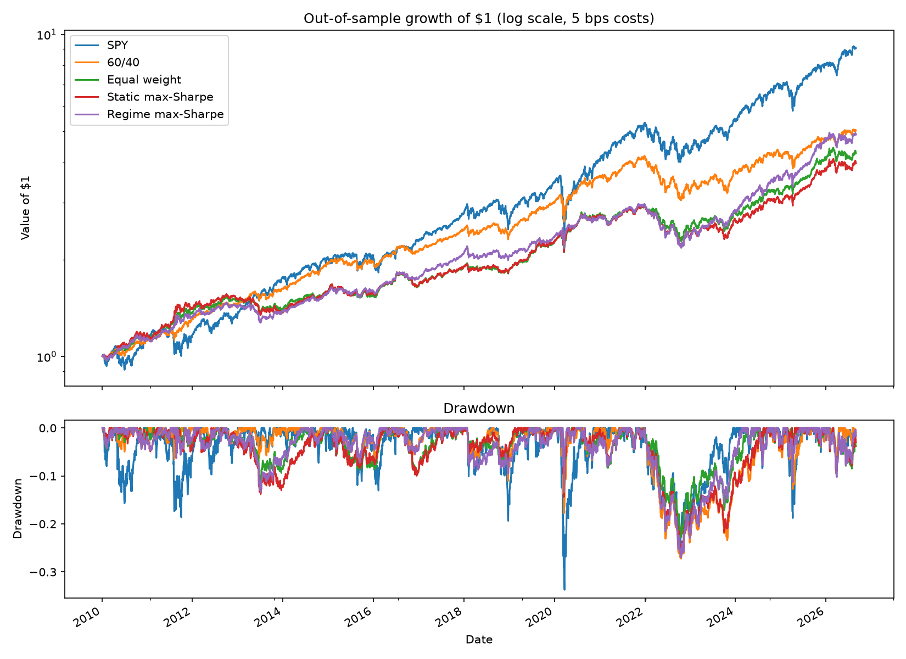

# Regime-Adaptive Portfolio

**Can switching a portfolio's allocation according to the market's regime beat simple diversification?**

A Gaussian Hidden Markov Model (HMM) detects market regimes from stock and bond behaviour. The portfolio then allocates between **SPY** (US stocks), **TLT** (long-term Treasuries) and **GLD** (gold) according to the detected regime. The strategy is evaluated with a **walk-forward backtest (2010–2026)** that retrains every year on past data only and estimates the current regime with the HMM forward filter, so there is no lookahead.

## Key results

**Out-of-sample, 2010-01-04 to 2026-08-31, 5 bps trading costs**

| Strategy | Return/yr | Volatility | Sharpe | Max drawdown | Turnover/yr |
|---|---|---|---|---|---|
| SPY | 14.2% | 17.1% | 0.83 | −33.7% | 0 |
| 60/40 (SPY/TLT) | 10.2% | 10.3% | 0.99 | −27.2% | 0 |
| Equal weight | 9.1% | 9.4% | 0.97 | −22.7% | 0 |
| Static max-Sharpe (no regimes) | 8.7% | 9.8% | 0.89 | −26.3% | 0.07× |
| **Regime max-Sharpe** | **10.0%** | **10.1%** | **0.99** | **−26.9%** | **3.4×** |



1. **The in-sample edge mostly disappears out-of-sample.** In-sample (notebook 03), the regime strategy reached a Sharpe of 1.07. Out-of-sample it scores 0.99, tied with a plain 60/40 portfolio.
2. **Regimes do improve the optimizer.** The same max-Sharpe optimizer without regimes scores only 0.89, so the regime information adds about +0.10 Sharpe. It is not enough to beat simple benchmarks.
3. **It protects in growth shocks, not in rate shocks.**

   | Crisis | SPY | 60/40 | Equal weight | Regime strategy |
   |---|---|---|---|---|
   | COVID crash (Feb–Mar 2020) | −33.4% | −16.0% | −8.5% | **−4.0%** |
   | 2022 rate hikes (Jan–Oct 2022) | −24.1% | −26.3% | **−21.2%** | −25.5% |

   Going into 2022, the model's stress-regime weights held about 42% long-term bonds, learned from earlier crises in which bonds hedged stocks. 2022 was the first rate shock in the training data, and stocks and bonds fell together.
4. **The edge is fragile to costs.** The strategy trades 3.4× its portfolio per year. At 20 bps per trade its Sharpe drops to 0.94, below equal weight (0.97).

**Conclusion:** an HMM regime model detects and protects against the *types* of stress it has already seen, but it cannot anticipate a new kind of crisis. After realistic costs it does not beat simple diversification out-of-sample.

## Method

| Step | What happens | Notebook |
|---|---|---|
| 1. Data | Daily adjusted prices for SPY, TLT, GLD (2005–2026, Yahoo Finance), log returns | `01_data_exploration` |
| 2. Regimes | HMM on 4 features: SPY 1-month return and volatility, TLT 1-month return, SPY–TLT 3-month correlation | `02_regime_detection` |
| 3. Weights | Long-only max-Sharpe (also min-variance, risk parity) per regime, max 80% per asset | `03_portfolio` |
| 4. Backtest | Yearly expanding-window refits, forward-filtered regime probabilities, probability-weighted weights, 5 bps costs | `04_backtest_results` |

**Three regimes found (full sample, notebook 02):**

| | Regime 0 | Regime 1 | Regime 2 |
|---|---|---|---|
| Interpretation | Calm, bonds don't hedge | Calm, bonds hedge | Stress |
| Share of days | 38% | 43% | 18% |
| SPY volatility | 10.7% | 13.4% | 31.3% |
| SPY–TLT correlation | +0.03 | −0.49 | −0.29 |
| Best asset (Sharpe) | SPY 1.12 | TLT 0.78 | GLD 0.45 |

**Avoiding lookahead bias:**
- Features use only past data (rolling windows).
- The scaler, HMM and regime statistics are refit each January on data up to the previous December 31.
- During the test year, today's regime comes from the **forward filter**, P(regime today | data up to today). `predict()` and `predict_proba()` in hmmlearn use the full sequence and would leak future information.
- Weights chosen at the close of day *t* earn day *t+1*'s return.

## Project structure

```
regime-portfolio/
├── data/
│   ├── raw/            # downloaded prices (re-created by src/data.py, not committed)
│   └── processed/      # log returns
├── notebooks/
│   ├── 01_data_exploration.ipynb
│   ├── 02_regime_detection.ipynb
│   ├── 03_portfolio.ipynb
│   └── 04_backtest_results.ipynb
├── src/
│   ├── config.py       # paths, seed, settings loaded from .env
│   ├── data.py         # download prices, compute returns, summary stats
│   ├── regimes.py      # features, HMM fit, regime labels and statistics
│   ├── portfolio.py    # per-regime weights (min-variance, risk parity, max-Sharpe), performance
│   └── backtest.py     # walk-forward refits, forward-filtered regime probabilities
├── model/              # saved HMM (pickle)
├── reports/            # backtest charts and CSV summaries
├── requirements.txt
├── .env.example
└── README.md
```

## How to rerun

Python 3.11.

```bash
git clone https://github.com/Molod02/regime-portfolio.git
cd regime-portfolio
conda create -n regime python=3.11 -y
conda activate regime
pip install -r requirements.txt
cp .env.example .env
jupyter notebook notebooks/
```

Run the notebooks in numerical order. The first run downloads data from Yahoo Finance and caches it in `data/raw/`; later runs reuse it. The random seed is fixed in `src/config.py`. Notebook 04 takes a few minutes (17 yearly refits).

## Assumptions & limitations

- **Data:** free Yahoo Finance adjusted prices; may contain errors or revisions.
- **Small universe:** three ETFs, so results may not generalize.
- **Short test history:** 2010–2026 contains few crises (essentially 2020 and 2022), so crisis results rest on very few events.
- **Favourable period for 60/40:** long-term bonds were in a bull market for most of 2010–2021.
- **Costs:** a flat 5 bps on turnover; no slippage, taxes or borrowing. Sensitivity to 0 and 20 bps is reported in notebook 04.
- **No parameter tuning on the test period:** the number of regimes, windows and weight cap were fixed before the backtest was run.

## Possible extensions

- Add rate and inflation features (e.g. changes in Treasury yields, breakeven inflation from FRED) so the model can tell rate shocks from growth shocks.
- Reduce turnover by trading only when regime probabilities change by more than a threshold.
- Add assets that behave differently in inflationary regimes (commodities, TIPS, short-term Treasuries).

## Lifecycle mapping

| Stage | Code | Notebook | Output |
|---|---|---|---|
| 1. Data | `src/data.py` | `01_data_exploration.ipynb` | `data/raw/prices.csv`, `data/processed/returns.csv` |
| 2. Regime detection | `src/regimes.py` | `02_regime_detection.ipynb` | `model/hmm.pkl` |
| 3. Portfolio construction | `src/portfolio.py` | `03_portfolio.ipynb` | weights per regime, in-sample performance |
| 4. Backtest | `src/backtest.py` | `04_backtest_results.ipynb` | `reports/backtest_*.png`, `reports/backtest_*.csv` |
